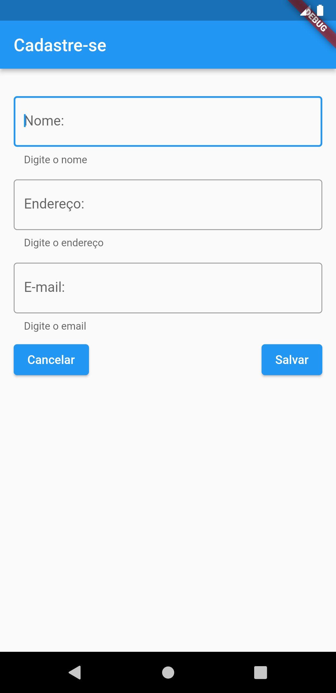

# Meu primeiro Gui

## DPM - Princípios de desenv. de prog. para disp. móveis

### Exercício: Montagem de uma GUI


[]

## Orientações

1. Não precisa ter nenhuma funcionalidade (a idéia é só exercitar a montagem da GUI)
2. Pode usar quaisquer recursos que você quiser
3. Além do que vimos nas aulas, usei:

- TextField (com InputDecoration)
- Spacer
- Pesquise!!!!

Pode usar uma função vazia na propriedade:

```
 onPressed (){}
```

